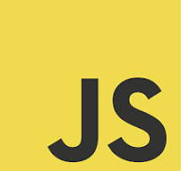
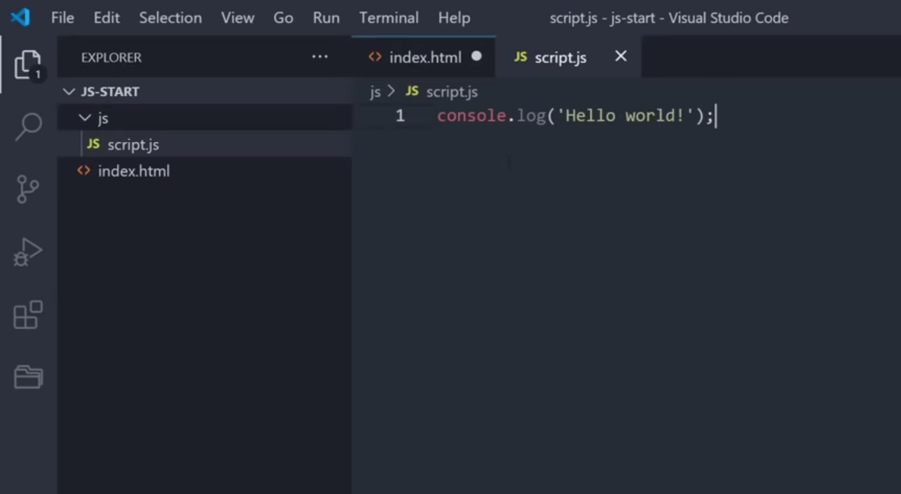
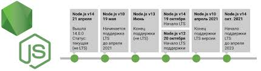
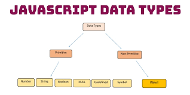
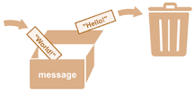
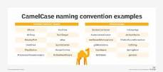

# Что такое JavaScript?
JavaScript это популярный язык програмирование.Согласно TIOBE Index, базирующемуся на данных поисковых систем Google, MSN, Yahoo!, Википедия и YouTube, в ноябре 2023 года JavaScript находился на 6-м месте.
 

## Особенности JavaScript
JavaScript простыми словами называют языком скриптов или сценариев. Скрипты — это набор инструкций, которые выполняются при загрузке страницы. Браузер самостоятельно интерпретирует код на JavaScript, для этого даже не требуется компиляция (перевод языка программирования в машинный код).

Скрипты можно прописать внутри кода страницы или подключить к HTML отдельным файлом. Например в стандартной разметке index.html JS-код прописывают внутри тега script, помещенного в тег body.

Тогда в браузере благодаря инструкции console.log появится слово.

# Для чего нужен JS
В веб-приложениях HTML отвечает за разметку страницы. Расположение контента, внешний вид интерфейса описывается с помощью CSS, а JavaScript отвечает за интерактивность и функционал этого интерфейса. Вот примеры задач, которые решает JS :

* Взаимодействие с пользователем.JS помогает заполнить необходимые поля в формах, проверять буквенные и числовые значения, а также управлять HTML-элементами на странице. Например, в конструкторе лендингов Tilda можно перетаскивать блоки и по клику менять шрифты, цвета текста, фонов и другие значения.

* Анимация.Это не только движущиеся объекты на странице и кнопки, но и карусель в галерее или плавная прокрутка страницы. Например, Pinterest с помощью JavaScript создал эффект бесконечной ленты.

* Математические вычисления.С помощью JS-скриптов на сайтах реализованы калькуляторы, например подсчет суммы заказа в корзине интернет-магазина.

* Мобильные приложения: С использованием фреймворков, таких как React Native и NativeScript, JavaScript может быть использован для создания мобильных приложений для разных платформ.

* Серверный JavaScript: используется на серверной стороне с использованием платформы Node.js для создания высокопроизводительных и масштабируемых веб-приложений.

# Версии Javascript
JavaScript был придуман Бренданом Эйхом (Brendan Eich) в 1995 году и стал стандартом ECMA в 1997 году. Официальное название стандарта — ECMA. А официальное названия языка — ECMAScript. С 2015 года версию языка ECMAScript называют по году (ECMAScript 2015).

# JavaScript / ECMAScript

JavaScript был разработан для Netscape. Первым браузером, поддерживающим JavaScript, стал вышедший в 1996 году браузер Netscape 2. После Netscape компания Mozilla foundation продолжила разработку JavaScript для своих браузеров Firefox. Последняя версия JavaScript это 1.8.5 (идентична ECMAScript 5).ECMAScript был разработан Ecma International после адаптации JavaScript. Первая редакция ECMAScript вышла в 1997 году.

# Data Types
 ### В JS есть 2 дпата тайп :

 Primitives & Objests.

 

 # Primitive
 Примитив (значение примитивного типа, примитивный тип данных) это данные, которые не являются объектом и не имеют методов. В JavaScript 7 простых типов данных: string, number, boolean, null, undefined, symbol (новое в ECMAScript 2015), bigint.

 * Анимация.Это не только движущиеся объекты на странице и кнопки, но и карусель в галерее или плавная прокрутка страницы. Например, Pinterest с помощью JavaScript создал эффект бесконечной ленты.

* Математические вычисления.С помощью JS-скриптов на сайтах реализованы калькуляторы, например подсчет суммы заказа в корзине интернет-магазина.

* Мобильные приложения: С использованием фреймворков, таких как React Native и NativeScript, JavaScript может быть использован для создания мобильных приложений для разных платформ.

* Серверный JavaScript: используется на серверной стороне с использованием платформы Node.js для создания высокопроизводительных и масштабируемых веб-приложений.

# Objectes
* Object: представляет комплексный объект

# Что такое переменная в JavaScript?
Переменная Переменная – это «именованное хранилище» для данных. Мы можем использовать переменные для хранения товаров, посетителей и других данных. Для создания переменной в JavaScript используйте ключевое слово let .

# Что такое camelcase в JS?

CamelCase — это способ разделения слов во фразе путем написания первой буквы каждого слова заглавной и без использования пробелов . Он широко используется в веб-URL, программировании и соглашениях об именах компьютеров. Он назван в честь верблюдов, потому что заглавные буквы напоминают горбы на спине верблюда.

# Почему JS является динамическим языком?

Что означает Dynamic Language? JavaScript — это динамический язык, а не статический, что означает, что переменные могут содержать значения разных типов во время выполнения . В отличие от таких языков, как Typescript или Java, вам не нужно явно объявлять тип данных переменной.

